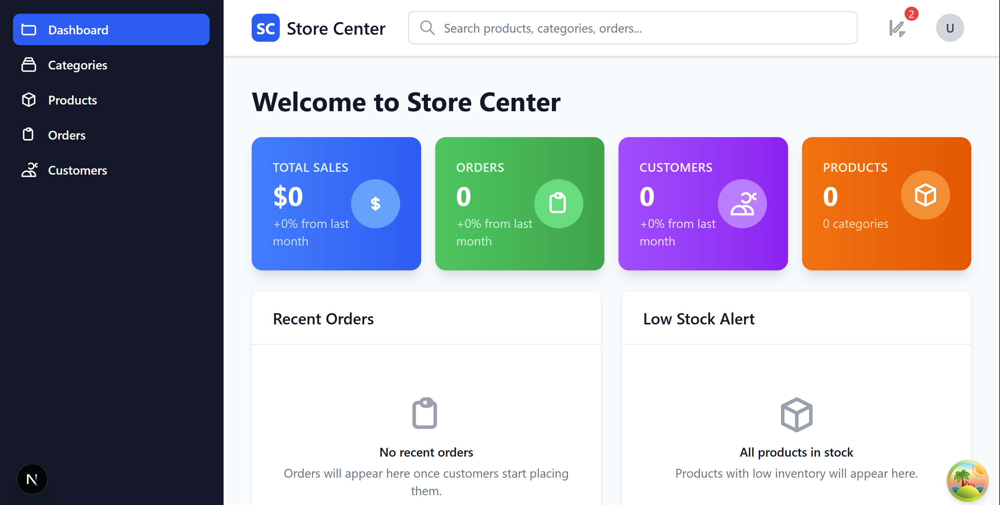

# StoreCenter - Enterprise Inventory Management System

StoreCenter is a comprehensive, enterprise-grade inventory management system built with modern technologies and architectural patterns. Featuring a **Clean Architecture** backend powered by **.NET 10.0** and **Entity Framework Core**, **MS SQL Server** paired with a **Next.js 15** frontend using **React 19** and **TypeScript**, this system delivers scalable inventory management solutions for businesses of all sizes.


<!-- Add an image here: It can be home page or any feature page -->

## 🏗️ **Technical Architecture**

**Backend Stack:**
- **.NET 10.0 Web API** with Clean Architecture (Domain, Application, Infrastructure, API layers)
- **Entity Framework Core 10.0** with SQL Server database
- **JWT Authentication** with role-based authorization and custom permissions
- **Serilog** structured logging with file and console output
- **Swagger/OpenAPI** documentation with JWT bearer authentication
- **Global exception handling** and CORS middleware

**Frontend Stack:**
- **Next.js 15** with App Router and Server-Side Rendering
- **React 19** with TypeScript for type safety
- **TanStack React Query v5** for efficient data fetching and caching  
- **Tailwind CSS 4** for modern, responsive UI design
- **Feature-Driven Architecture** with Domain-Driven Design principles
- **Axios** for API communication with automatic error handling

**Key Features:**
- **Multi-layered Security:** JWT tokens, role-based permissions, and secure API endpoints
- **Scalable Architecture:** Microservices-ready backend with clear separation of concerns
- **Real-time Data:** Optimistic updates and background synchronization
- **Professional Logging:** Structured logging with trace identifiers and log retention
- **Database Migrations:** Entity Framework Core migrations with seed data support


## Key Features
- Add, update, and delete inventory items
- Real-time stock tracking and notifications
- User authentication and role-based access control
- Generate detailed inventory and sales reports
- Barcode scanning and printing
- Supplier and purchase order management
- Multi-location inventory management
- Integration with accounting software
- Customizable inventory alerts and thresholds
- Import and export inventory data
- Audit trails and transaction history
- Mobile-friendly interface
- API for third-party integrations
- Data backup and restore functionality
- Comprehensive dashboard and analytics
- Multi-language support
- Customer management and order tracking
- Inventory forecasting and demand planning
- Batch and expiry date tracking
- Support for various units of measurement
- Inventory valuation methods (FIFO, LIFO, etc.)
- Customizable user permissions and settings
- Integration with e-commerce platforms
- Inventory reconciliation and adjustment tools
- Detailed documentation and support
- Regular updates and feature enhancements

## 📋 **Prerequisites**

Before setting up StoreCenter, ensure you have the following tools and environments configured:

### **🔧 Development Tools**
- **[.NET SDK 10.0](https://dotnet.microsoft.com/download)** or higher
- **[Node.js 18.0+](https://nodejs.org/)** with npm or yarn package manager
- **[Git](https://git-scm.com/)** for version control

### **🗄️ Database Requirements**
- **[SQL Server 2019+](https://www.microsoft.com/sql-server/)** (Express, Developer, or Enterprise)
- Alternative options: **SQL Server LocalDB** for development
- **SQL Server Management Studio (SSMS)** or **Azure Data Studio** (recommended)

### **🛠️ Optional but Recommended**
- **[Visual Studio 2026](https://visualstudio.microsoft.com/)** or **[VS Code](https://code.visualstudio.com/)** with C# extension
- **[Postman](https://www.postman.com/)** or **[Thunder Client](https://www.thunderclient.com/)** for API testing
- **[Docker Desktop](https://www.docker.com/products/docker-desktop/)** (for containerized deployment)

### **⚡ System Requirements**
- **OS**: Windows 10/11, macOS 10.15+, or Linux (Ubuntu 18.04+)
- **RAM**: Minimum 4GB (8GB+ recommended)
- **Storage**: At least 2GB free space for dependencies and database
- **Network**: Internet connection for package downloads

### **🔍 Verification Commands**
Run these commands to verify your installation:
```bash
# Check .NET version
dotnet --version

# Check Node.js version  
node --version
npm --version

# Check Git version
git --version
```

## 🚀 **Getting Started**

Get StoreCenter up and running on your local machine in just a few steps:

### **📥 Clone Repository**

```bash
git clone https://github.com/mahedee/store-center.git
cd store-center
```

### **🔧 Backend Setup (.NET 10.0)**

```bash
# Navigate to API project and restore all dependencies
cd backend/StoreCenter/StoreCenter.API
dotnet restore

# Restore other project dependencies
cd ../StoreCenter.Application && dotnet restore
cd ../StoreCenter.Domain && dotnet restore  
cd ../StoreCenter.Infrastructure && dotnet restore
```

**Database Configuration:**
1. Create database named `IMSDB` in SQL Server
2. Update connection string in `appsettings.json`:

```json
{
  "ConnectionStrings": {
    "DefaultConnection": "Server=.;Database=IMSDB;User Id=sa;Password=YourPassword;TrustServerCertificate=True;"
  }
}
```

**Apply migrations and start server:**
```bash
cd backend/StoreCenter/StoreCenter.API
dotnet ef database update
dotnet run
```

**🌐 Backend Available:** `http://localhost:8080/swagger/index.html`

### **🎨 Frontend Setup (Next.js 15)**

```bash
# Install frontend dependencies
cd StoreCenter.Client
npm install
```

**Configure API connection in `.env.local`:**
```env
NEXT_PUBLIC_API_BASE_URL=http://localhost:8080/api
```

**Start development server:**
```bash
npm run dev
```

**🌐 Frontend Available:** `http://localhost:3000`

### **🔑 Login Credentials**

- **Username:** `admin`
- **Password:** `P@ssW0rd`

### **✅ Quick Verification**

1. Ensure SQL Server is running
2. Backend: Visit `http://localhost:8080/swagger/index.html`
3. Frontend: Open `http://localhost:3000`
4. Login and start managing inventory!


## Usage
After setting up, log in to the application using the following credentials:
- Username: admin
- Password: P@ssW0rd

Start managing your inventory. Refer to the documentation (link if applicable) for detailed usage instructions.

## 🤝 **Contributing**

We welcome contributions from developers of all skill levels! Whether you're fixing bugs, adding features, improving documentation, or sharing ideas, your contribution matters.

### **🎯 How to Contribute**

#### **🐛 Report Issues**
Found a bug or have a suggestion? Please check existing issues first, then:
- **[🐞 Report a Bug](https://github.com/mahedee/store-center/issues/new?template=bug_report.md)**
- **[💡 Request a Feature](https://github.com/mahedee/store-center/issues/new?template=feature_request.md)**
- **[📝 Improve Documentation](https://github.com/mahedee/store-center/issues/new?template=documentation_improvement.md)**
- **[❓ Ask a Question](https://github.com/mahedee/store-center/issues/new?template=general_issue.md)**

#### **🔧 Code Contributions**
1. **Fork the repository** and create your feature branch
2. **[Follow this document to know how to contribute](CONTRIBUTING.md)**
3. **Write tests** for your changes
4. **Submit a pull request** following our [PR Guidelines](pullrequest-guidelines.md)


### **🏆 Contributors**

Thanks to all the amazing people who have contributed to this project!

<!-- Contributors will be added here automatically -->
<a href="https://github.com/mahedee/store-center/graphs/contributors">
  
</a>

### **🎖️ Recognition**

We believe in recognizing contributors:
- **🥇 Top Contributors**: Featured in README and social media
- **🏆 Monthly Recognition**: Special mentions in project updates
- **📜 Contributor Certificate**: Digital certificates for significant contributions

## License
This project is licensed under the MIT License. See `LICENSE` for details.

## Contact
For questions or feedback, contact:
- __Maintainers__: 
    - Name: Mahedee Hasan
    - Email: mahedee.hasan@gmail.com
    - GitHub: [Mahedee](https://github.com/mahedee)
    - Website: [mahedee.net](https://mahedee.net)
- Slack: [Slack Channel](https://slack.com)
- Forum: [Forum](https://forum.com)
- WhatsApp: [WhatsApp Group](https://whatsapp.com)

<!-- How to add Contributors in github -->

## Acknowledgments
Special thanks to all contributors and the open-source community for their support.
